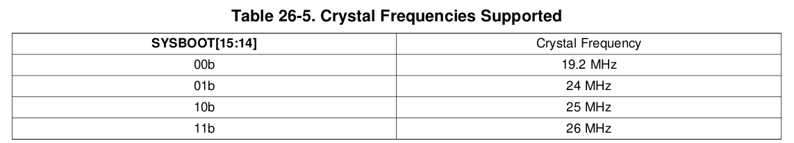
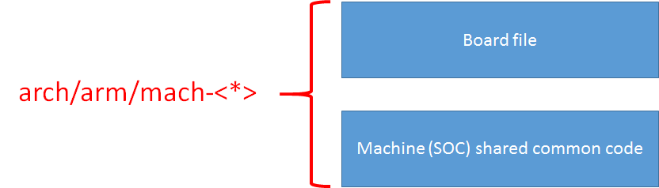

# am335x_bbb

## Function Block Diagram


## Linux Boot Requirements
What do we need to successfully boot Linux on the hardware such as Beaglebone Black?

1. RBL (Runs out of ROM)
    * RBL stands for "ROM Boot Loader"
    * Very first piece of code to run on the SOC when you supply the power to the board.
    * This Boot loader is written by the vendor and stored in ROM of the SOC during the production of this chip. You cannot change it!
    * The major job of the RBL is to load and run the second stage boot loader as SPL or MLO
2. SPL/MLO (Runs out of internal SRAM)
    * SPL stands for "Second Program Loader"
    * MLO stands for "Memory LOader"
    * The job of the Second stage boot loader is to load and execute the third stage boot loader such as U-boot
    * MLO = SPL + Header. This header will tell you the internal RAM adress at which the SPL is going to get transferred.
3. U-boot (Runs out of DDR)
    * The job of the third stage boot loader is to load and run the Linux kernel
4. Linux Kernel (Runs out of DDR)
5. RFS (SD/Flash/Network/RAM/eMMC)
    * Root filesystem

**Note. The second stage boot loader that is SPL is also derived form the U-boot source code.**

## The boot procedure
1. Power on Reset
2. RBL runs out of ROM
3. RBL copies MLO into internal RAM
4. MLO executes from the internal RAM and copies u-boot to DDR
5. U-boot Runs out of DDR memory

## Beaglebone Boot Options


**SYSBOOT** is one of the register of this SOC and its first five bits decide the boot order.

*Example: When SYSBOOT[4:0] = 00001b*

After the RESET if SYSBOOT[4:0] = 00001b, then SOC will try to boot from UART0 first, if fails, then it tries to boot from XIP (XIP stands for eXutable In Place memory like NOR Flash), if that also fails, then it will try to boot from MMC0, if no success, finally it tries to boot from SPI0, if that also fails, then SOCK outputs the error message and stops.

The bootstrap pin of Beaglebon Black is as followoing:


It mapped to following boot sequence:


*If you want to boot from SD card*
1. Connect SD card to the SD card slot of the BBB
2. Press and hold the S2 button (BOOT button)
3. Press the S3 button (POWER button)
4. Release the S2 button

## ROM Code Startup Sequence


* Upon system startup, the CPU performs the public-side initialization and stack setup. Then it configures the watchdog timer 1 (set to three minutes), performs system clock configuration. Finally it jumps to the booting routine.

* The device supports the following frequencies based on SYSBOOT[15:14]


Based on the value of 15:14 bits of the SYSBOOT register, the RBL comes to know about the value of the external crystal connected to the SOC.

The ROM code configures the clocks and DPLLs which are necessary for ROM code execution:
* L3 ADPLLS locked to provide 200MHz clocks for peripheral blocks
* DDR DPLL locked to provide 400MHz
* MPU ADPLLS is locked to provide 500MHZ for the A8
* PER ADPLLLJ is lockd to provide 960MHz and 192MHz for peripheral blocks

**Note. You can not make the ROM bootloader to change these clock frequencies. This is fiexd. You can only do that in the second stage boot loader.**

* Booting


RBL tries to fetch the second stage boot loader from the devices list as per the value of SYSBOOT[4:0].

Once the booting device list is set up, the booting routine examines the device enumerated in the list sequentially and either execute the memory booting or peripheral booting procedure depending on the booting device type.

The memory booting procedure is executed when the booting device type is one of NOR, NAND, MMC or SPI-EEPROM. The peripheral booting is executed when the booting device type is Ethernet, USB or UART.

If the memory or peripheral booting fails for all devices enumerated in the device list then the ROM Code gets into a loop, waiting for the watchdog to reset the system.

**Then the ROM code copies the MLO/SPL to the internal RAM of the SOC. MLO or SPL will have its own image header. This image header is decided by TI itself. The RBl first reads the image header of the MLO. From the image header, it will get 2 important information. One is the loader address and another one is the total size of the MLO. So, the RBL will load the MLO to the internal RAM address indicated by the image header of the MLO.**

### RBL does
* Stack setup
* Watchdog timer 1 configuration (set to 3 mintues timeout)
* System clock configuration using PLL
* Search Memory devices or other bootable interfaces for MLO or SPL
* Copy MLO or SPL into the internal SRAM of the chip
* Execute MLO or SPL

## MLO/SPL Job
MLO or SPL initializes the SOC to a point that, U-boot can be loaded into external RAM (DDR Memory).

1. It does UART console initalization to print out the debug messgaes.
2. Reconfigures the PLL to desired value.
3. Initializes the DDR registers to use the DDR memory.
4. Does muxing configurations of boot peripherals pin, because its next job is to load the u-boot from the boot peripherals.
5. eg. If MLO is going to get the u-boot from the MMC0 or MMC1 interfaces, then it will do the mux configurations to bring out the MMC0 or MMC1 functionalities on the pins.
6. Copies the u-boot images into the DDR memory and passed control to it. (U-boot also will have its own images header which indicates the load address and the size of image.)

**Note. Remember that, MLO will not load the third stage boot loader like u-boot ot the internal RAM of the SOC. Because, the internal RAM is only of 128KB.**

---
#### Question1: Can we avoid using MLO or SPL by making RBL directly loads the u-boot into internal SRAM?

In order to load and run u-boot from the internal SRAM, you have squeeze u-boot image to <128KB of size. This is the reason whey we use MLO or SPL.

---
#### Question2: Can we use RBL to load u-boot directly into DDR memory of the board and skip using MLO or SPL?

No. The reason why ROM boot loader of the AM335x SOC cannot load u-boot directly to DDR3 by skipping SPL is, **ROM code won't be having any idea about what kind of DDR RAM being used in the product to initialize it. DDR RAM is purely product/board specific.**

Let's say there are 3 board/product manufacturing companies X, Y, Z

X may design a product using AM335x SOC with DDR3. In which lets say DDR3 RAM is produced by microchip.

Y may desing its product using AM335x SOC with DDR2 produced by Transcend and Z may not use DDR memory at all for its product.

So, RBL has no idea in which product this chip will be used and what kind of DDR will be used, and what are DDR tuning parameters like speed, bandwidth, clock augments, size, etc.

Becase to read (or write) anything from/to DDR RAM, first, the tuning parameters must be set properly and DDR registers must be initalized properly.

Every different manufacture will have different parameters for their RAM. So, that's the reason RBL never care aboutl initializing DDR controller of the chip and DDR RAM which is connected to chip.

RBL just tries to fetch the SPL found in memory devices such as eMMC and SD card or peripherals like UART, EMAC, etc.

And in the SPL/MLO, you should know, what kind of DDR is connected to your product and based on that you have to change the SPL code, rebuild it and generate the binary to use it as the second stage boot loader.

For example the Beaglebon black uses DDR3 from Kingston and if your product used DDR3 from transcend, then if the tuning paramters are differenet then you have to change the DDR related header files and the tuning parameters macros of the SPL. rebuild and generate the binary.

### SPL/MLO output message

```
U-Boot SPL 2013.04-dirty (Jun 19 2013 - 09:57:14)
musb-hdrc: ConfigData=0xde (UTMI-8, dyn FIFOs, HB-ISO Rx, HB-ISO Tx, SoftConn)
musb-hdrc: MHDRC RTL version 2.0
musb-hdrc: setup fifo_mode 4
musb-hdrc: 28/31 max ep, 16384/16384 memory
USB Peripheral mode controller at 47401000 using PIO, IRQ 0
musb-hdrc: ConfigData=0xde (UTMI-8, dyn FIFOs, HB-ISO Rx, HB-ISO Tx, SoftConn)
musb-hdrc: MHDRC RTL version 2.0
musb-hdrc: setup fifo_mode 4
musb-hdrc: 28/31 max ep, 16384/16384 memory
USB Host mode controller at 47401800 using PIO, IRQ 0
OMAP SD/MMC: 0
reading u-boot.img
reading u-boot.img
```

## U-boot

### The job of U-boot
1. Initialize some of the peripherals like I2C, NAND, FLASH, Ethernet, UART, USB, MMC, etc. Because it supports loading kernel from all there peripherals.
2. Load the Linux kernel image from various boot sources to the DDR memory of the board.
3. Boot sources; USB, eMMC, SD Card, Ethernet, Serial port, NAND flash, etc.
4. Passing of boot arguments to the kernel.

### uEnv.txt
* You can change the boot behavior of the u-boot by using a file called uEnv.txt.
* Use this file to set the env variables which drives the u-boot according to your need.

```
console=ttyO0,115200n8
ipaddr=192.168.7.2
serverip=192.168.7.1
loadaddr=0x82000000
fdtaddr=0x88000000
loadfromsd=load mmc 0:2 ${loadaddr} /boot/uImage;load mmc 0:2 ${fdtaddr} /boot/am335x-boneblack.dtb
linuxbootargs=setenv bootargs console=${console} root=/dev/mmcblk0p2 rw
uenvcmd=setenv autoload no; run loadfromsd; run linuxbootargs; bootm ${loadaddr} - ${fdtaddr}
```

### uImage vs. zImage
* U-boot always looks for uImage. uImage is nothing but zImage plus U-boot header.


### U-boot Linux Image header
```
/*
 * Legacy format image header,
 * all data in network byte order (aka natural aka bigendian).
 */
typedef struct image_header {
    uint32_t    ih_magic;   /* Image Header Magic Number */
    uint32_t    ih_hcrc;    /* Image Header CRC Checksum */
    uint32_t    ih_time;    /* Image Creation Timestamp */
    uint32_t    ih_size;    /* Image Data Size */
    uint32_t    ih_load;    /* Data| Load  Address */
    uint32_t    ih_ep;      /* Entry Point Address */
    uint32_t    ih_dcrc;    /* Image Data CRC Checksum */
    uint8_t     ih_os;      /* Operating System */
    uint8_t     ih_arch;    /* CPU architecture */
    uint8_t     ih_type;    /* Image Type */
    uint8_t     ih_comp;    /* Compression Type */
    uint8_t     ih_name[IH_NMLEN];  /* Image Name */
} image_header_t;
```

### U-boot output message
```
U-Boot 2013.04-dirty (Jun 19 2013 - 09:57:14)

I2C:   ready
DRAM:  512 MiB
WARNING: Caches not enabled
NAND:  No NAND device found!!!
0 MiB
MMC:   OMAP SD/MMC: 0, OMAP SD/MMC: 1
*** Warning - readenv() failed, using default environment

musb-hdrc: ConfigData=0xde (UTMI-8, dyn FIFOs, HB-ISO Rx, HB-ISO Tx, SoftConn)
musb-hdrc: MHDRC RTL version 2.0
musb-hdrc: setup fifo_mode 4
musb-hdrc: 28/31 max ep, 16384/16384 memory
USB Peripheral mode controller at 47401000 using PIO, IRQ 0
musb-hdrc: ConfigData=0xde (UTMI-8, dyn FIFOs, HB-ISO Rx, HB-ISO Tx, SoftConn)
musb-hdrc: MHDRC RTL version 2.0
musb-hdrc: setup fifo_mode 4
musb-hdrc: 28/31 max ep, 16384/16384 memory
USB Host mode controller at 47401800 using PIO, IRQ 0
Net:   <ethaddr> not set. Validating first E-fuse MAC
cpsw, usb_ether
Hit any key to stop autoboot:  0
gpio: pin 53 (gpio 53) value is 1
mmc0 is current device
micro SD card found
mmc0 is current device
gpio: pin 54 (gpio 54) value is 1
SD/MMC found on device 0
reading uEnv.txt
370 bytes read in 3 ms (120.1 KiB/s)
Loaded environment from uEnv.txt
Importing environment from mmc ...
Running uenvcmd ...
8645240 bytes read in 1009 ms (8.2 MiB/s)
56827 bytes read in 20 ms (2.7 MiB/s)
## Booting kernel from Legacy Image at 82000000 ...
   Image Name:   Linux-4.4.62
   Image Type:   ARM Linux Kernel Image (uncompressed)
   Data Size:    8645176 Bytes = 8.2 MiB
   Load Address: 80008000
   Entry Point:  80008000
   Verifying Checksum ... OK
## Flattened Device Tree blob at 88000000
   Booting using the fdt blob at 0x88000000
   Loading Kernel Image ... OK
OK
   Using Device Tree in place at 88000000, end 88010dfa

Starting kernel ...

```

---
### U-boot command
1. Load the uImage from Memory device (SD card/eMMC) into the DDR memory of the board
2. Use the memory dump comand of u-boot to dump header information

* To load a file from FAT based file system into memory use: fatload
* To load a file from any file system: load

```
Example:
fatload usb 0:1 0x82000000 uImage
fatload mmc 0:1 0x88000000 initramfs
load mmc 0:1 0x88000000 uImage
```

* MMC0 interface ==> SD card
* MMC1 interface ==> eMMC

Load command:
```
U-Boot# help load
load - load binary file from a filesystem

Usage:
load <interface> [<dev[:part]> [<addr> [<filename> [bytes [pos]]]]]
    - Load binary file 'filename' from partition 'part' on device
       type 'interface' instance 'dev' to address 'addr' in memory.
      'bytes' gives the size to load in bytes.
      If 'bytes' is 0 or omitted, the file is read until the end.
      'pos' gives the file byte position to start reading from.
      If 'pos' is 0 or omitted, the file is read from the start.
      All numeric parameters are assumed to be decimal,
      unless specified otherwise using a leading "0x".

U-Boot# load mmc 0:2 0x82000000 /boot/uImage
8645240 bytes read in 1010 ms (8.2 MiB/s)
U-Boot# md 0x82000000 10
82000000: 56190527 b162bfef 900a0859 38ea8300    ...V..b.Y......8  # 38ea8300 means img size
82000010: 00800080 00800080 6503fd8c 00020205    ...........e....  # 0800080 means load address
82000020: 756e694c 2e342d78 32362e34 00000000    Linux-4.4.62....
82000030: 00000000 00000000 00000000 00000000    ................
U-Boot# help imi
iminfo - print header information for application image

Usage:
iminfo addr [addr ...]
    - print header information for application image starting at
      address 'addr' in memory; this includes verification of the
      image contents (magic number, header and payload checksums)
U-Boot# imi 0x82000000

## Checking Image at 82000000 ...
   Legacy image found
   Image Name:   Linux-4.4.62
   Image Type:   ARM Linux Kernel Image (uncompressed)
   Data Size:    8645176 Bytes = 8.2 MiB
   Load Address: 80008000
   Entry Point:  80008000
   Verifying Checksum ... OK

```

## Boot Strap Loader
Uncompression and relocation of the Linux Kernel image is not responsibility of U-boot. It's the responsibility of the bootstrap loader which is glued to the Linux Kernel Image.

### Control Flow during Linux boot


#### How U-boot hands off control to the "Boot Strap Loader" of the Linux kernel??
1. bootm.c (arch/arm/lib/)
    * **Run kernel_entry()**
    * Read the linux kernel from the memory, verify the checksum, handing off control is implemented.

```
static void boot_jump_linux(bootm_headers_t *images, int flag)
{
    ...

    unsigned long machid = gd->bd->bi_arch_number;
    char *s;
    void (*kernel_entry)(int zero, int arch, uint params);
    unsigned long r2;
    int fake = (flag & BOOTM_STATE_OS_FAKE_GO);

    kernel_entry = (void (*)(int, int, uint))images->ep;

    s = getenv("machid");
    if (s) {
        if (strict_strtoul(s, 16, &machid) < 0) {
            debug("strict_strtoul failed!\n");
            return;
        }
        printf("Using machid 0x%lx from environment\n", machid);
    }

    debug("## Transferring control to Linux (at address %08lx)" \
        "...\n", (ulong) kernel_entry);
    bootstage_mark(BOOTSTAGE_ID_RUN_OS);
    announce_and_cleanup(fake);

    if (IMAGE_ENABLE_OF_LIBFDT && images->ft_len)
        // ft_addr is holding the address at which the "Device tree binary" is present in the DDR memory
        r2 = (unsigned long)images->ft_addr;
    else
        r2 = gd->bd->bi_boot_params;

    if (!fake) {
#ifdef CONFIG_ARMV7_NONSEC
        if (armv7_boot_nonsec()) {
            armv7_init_nonsec();
            secure_ram_addr(_do_nonsec_entry)(kernel_entry,
                0, machid, r2);
        } else
#endif
            // Important!! This code hands off control to the Linux. The "entry point" address is dereferenced
            // machid: Machine id of the board which is detected by the U-boot. Passed to linux via register "r1"
            // Address of the "DTB" present in the DDR RAM. Passed to linux via Register "r2"
            kernel_entry(0, machid, r2);
    }
#endif
}
```


2. head.S (arch/arm/boot/compressed)
    * **Run Start:**
    * Call decompress_kernel() in misc.c
    * Enter kernel
3. misc.c (arch/arm/boot/compressed)
    * **Run decompress_kernel()**
    * Decompression of the compressed kernel happens in "misc.c"
4. head.S (arch/arm/kernel)
    1. CPU specific initializations
    2. Checks for valid processor architecture
    3. Page table inits
    4. Initialize and prepare MMU for the identified Processor Architecture
    5. Enable MMU to support virtual memory
    6. Calls "start_kernel" function of the main.c ("Arch" independent code)

head.S
```
/*
 * Kernel startup entry point.
 * ---------------------------
 *
 * This is normally called from the decompressor code.  The requirements
 * are: MMU = off, D-cache = off, I-cache = dont care, r0 = 0,
 * r1 = machine nr, r2 = atags or dtb pointer.
 *
 * This code is mostly position independent, so if you link the kernel at
 * 0xc0008000, you call this at __pa(0xc0008000).
 *
 * See linux/arch/arm/tools/mach-types for the complete list of machine
 * numbers for r1.
 *
 * We're trying to keep crap to a minimum; DO NOT add any machine specific
 * crap here - that's what the boot loader (or in extreme, well justified
 * circumstances, zImage) is for.
 */
	.arm

	__HEAD
ENTRY(stext)
 ARM_BE8(setend	be )			@ ensure we are in BE8 mode

 THUMB(	badr	r9, 1f		)	@ Kernel is always entered in ARM.
 THUMB(	bx	r9		)	@ If this is a Thumb-2 kernel,
 THUMB(	.thumb			)	@ switch to Thumb now.
 THUMB(1:			)

#ifdef CONFIG_ARM_VIRT_EXT
	bl	__hyp_stub_install
#endif
	@ ensure svc mode and all interrupts masked
	safe_svcmode_maskall r9

	mrc	p15, 0, r9, c0, c0		@ get processor id
	bl	__lookup_processor_type		@ r5=procinfo r9=cpuid
	movs	r10, r5				@ invalid processor (r5=0)?
 THUMB( it	eq )		@ force fixup-able long branch encoding
	beq	__error_p			@ yes, error 'p'

...


	/*
	 * The following calls CPU specific code in a position independent
	 * manner.  See arch/arm/mm/proc-*.S for details.  r10 = base of
	 * xxx_proc_info structure selected by __lookup_processor_type
	 * above.
	 *
	 * The processor init function will be called with:
	 *  r1 - machine type
	 *  r2 - boot data (atags/dt) pointer
	 *  r4 - translation table base (low word)
	 *  r5 - translation table base (high word, if LPAE)
	 *  r8 - translation table base 1 (pfn if LPAE)
	 *  r9 - cpuid
	 *  r13 - virtual address for __enable_mmu -> __turn_mmu_on
	 *
	 * On return, the CPU will be ready for the MMU to be turned on,
	 * r0 will hold the CPU control register value, r1, r2, r4, and
	 * r9 will be preserved.  r5 will also be preserved if LPAE.
	 */
	ldr	r13, =__mmap_switched		@ address to jump to after
						@ mmu has been enabled
	badr	lr, 1f				@ return (PIC) address
#ifdef CONFIG_ARM_LPAE
	mov	r5, #0				@ high TTBR0
	mov	r8, r4, lsr #12			@ TTBR1 is swapper_pg_dir pfn
#else
	mov	r8, r4				@ set TTBR1 to swapper_pg_dir
#endif
	ldr	r12, [r10, #PROCINFO_INITFUNC]
	add	r12, r12, r10
	ret	r12
1:	b	__enable_mmu
ENDPROC(stext)
```

5. head-common.S (arch/arm/kernel)
    * **Call start_kernel()**
```
/*
 * The following fragment of code is executed with the MMU on in MMU mode,
 * and uses absolute addresses; this is not position independent.
 *
 *  r0  = cp#15 control register
 *  r1  = machine ID
 *  r2  = atags/dtb pointer
 *  r9  = processor ID
 */
	__INIT
__mmap_switched:
	adr	r3, __mmap_switched_data

	ldmia	r3!, {r4, r5, r6, r7}
	cmp	r4, r5				@ Copy data segment if needed
1:	cmpne	r5, r6
	ldrne	fp, [r4], #4
	strne	fp, [r5], #4
	bne	1b

	mov	fp, #0				@ Clear BSS (and zero fp)
1:	cmp	r6, r7
	strcc	fp, [r6],#4
	bcc	1b

 ARM(	ldmia	r3, {r4, r5, r6, r7, sp})
 THUMB(	ldmia	r3, {r4, r5, r6, r7}	)
 THUMB(	ldr	sp, [r3, #16]		)
	str	r9, [r4]			@ Save processor ID
	str	r1, [r5]			@ Save machine type
	str	r2, [r6]			@ Save atags pointer
	cmp	r7, #0
	strne	r0, [r7]			@ Save control register values
	b	start_kernel
ENDPROC(__mmap_switched)
```

6. main.c (init/)
    * Entry into Arch. Indenpedent code of the Linux Kernel
    * rest_init() create 2 kernel thread, one is called kernel_init and another one is called kthreadd
    * kernel_init is a kernel thread which is used to spawn the very first Linux application that is init.
    * kthreadd is also another kernel thread which is used to spawn other kernel threads.

```
asmlinkage __visible void __init start_kernel(void)
{
	char *command_line;
	char *after_dashes;

	set_task_stack_end_magic(&init_task);
	smp_setup_processor_id();
	debug_objects_early_init();

	cgroup_init_early();

	local_irq_disable();
	early_boot_irqs_disabled = true;

	/*
	 * Interrupts are still disabled. Do necessary setups, then
	 * enable them.
	 */
	boot_cpu_init();
	page_address_init();
	pr_notice("%s", linux_banner);
	setup_arch(&command_line);

...

	/*
	 * These use large bootmem allocations and must precede
	 * kmem_cache_init()
	 */
	setup_log_buf(0);
	pidhash_init();
	vfs_caches_init_early();
	sort_main_extable();
	trap_init();
	mm_init();

	ftrace_init();

	/* trace_printk can be enabled here */
	early_trace_init();

	/*
	 * Set up the scheduler prior starting any interrupts (such as the
	 * timer interrupt). Full topology setup happens at smp_init()
	 * time - but meanwhile we still have a functioning scheduler.
	 */
	sched_init();
	/*
	 * Disable preemption - early bootup scheduling is extremely
	 * fragile until we cpu_idle() for the first time.
	 */
	preempt_disable();
	if (WARN(!irqs_disabled(),
		 "Interrupts were enabled *very* early, fixing it\n"))
		local_irq_disable();
	radix_tree_init();

	/*
	 * Allow workqueue creation and work item queueing/cancelling
	 * early.  Work item execution depends on kthreads and starts after
	 * workqueue_init().
	 */
	workqueue_init_early();

	rcu_init();

	/* Trace events are available after this */
	trace_init();

	context_tracking_init();
	/* init some links before init_ISA_irqs() */
	early_irq_init();
	init_IRQ();
	tick_init();
	rcu_init_nohz();
	init_timers();
	hrtimers_init();
	softirq_init();
	timekeeping_init();
	time_init();
	sched_clock_postinit();
	printk_safe_init();
	perf_event_init();
	profile_init();
	call_function_init();
	WARN(!irqs_disabled(), "Interrupts were enabled early\n");
	early_boot_irqs_disabled = false;
	local_irq_enable();

	kmem_cache_init_late();

	/*
	 * HACK ALERT! This is early. We're enabling the console before
	 * we've done PCI setups etc, and console_init() must be aware of
	 * this. But we do want output early, in case something goes wrong.
	 */
	console_init();
	if (panic_later)
		panic("Too many boot %s vars at `%s'", panic_later,
		      panic_param);

	lockdep_info();

	/*
	 * Need to run this when irqs are enabled, because it wants
	 * to self-test [hard/soft]-irqs on/off lock inversion bugs
	 * too:
	 */
	locking_selftest();

	/*
	 * This needs to be called before any devices perform DMA
	 * operations that might use the SWIOTLB bounce buffers. It will
	 * mark the bounce buffers as decrypted so that their usage will
	 * not cause "plain-text" data to be decrypted when accessed.
	 */
	mem_encrypt_init();

#ifdef CONFIG_BLK_DEV_INITRD
	if (initrd_start && !initrd_below_start_ok &&
	    page_to_pfn(virt_to_page((void *)initrd_start)) < min_low_pfn) {
		pr_crit("initrd overwritten (0x%08lx < 0x%08lx) - disabling it.\n",
		    page_to_pfn(virt_to_page((void *)initrd_start)),
		    min_low_pfn);
		initrd_start = 0;
	}
#endif
	kmemleak_init();
	debug_objects_mem_init();
	setup_per_cpu_pageset();
	numa_policy_init();
	if (late_time_init)
		late_time_init();
	calibrate_delay();
	pidmap_init();
	anon_vma_init();
	acpi_early_init();
#ifdef CONFIG_X86
	if (efi_enabled(EFI_RUNTIME_SERVICES))
		efi_enter_virtual_mode();
#endif
	thread_stack_cache_init();
	cred_init();
	fork_init();
	proc_caches_init();
	buffer_init();
	key_init();
	security_init();
	dbg_late_init();
	vfs_caches_init();
	pagecache_init();
	signals_init();
	proc_root_init();
	nsfs_init();
	cpuset_init();
	cgroup_init();
	taskstats_init_early();
	delayacct_init();

	check_bugs();

	acpi_subsystem_init();
	arch_post_acpi_subsys_init();
	sfi_init_late();

	if (efi_enabled(EFI_RUNTIME_SERVICES)) {
		efi_free_boot_services();
	}

	/* Do the rest non-__init'ed, we're now alive */
	rest_init();
}

static noinline void __ref rest_init(void)
{
	struct task_struct *tsk;
	int pid;

	rcu_scheduler_starting();
	/*
	 * We need to spawn init first so that it obtains pid 1, however
	 * the init task will end up wanting to create kthreads, which, if
	 * we schedule it before we create kthreadd, will OOPS.
	 */
	pid = kernel_thread(kernel_init, NULL, CLONE_FS);
	/*
	 * Pin init on the boot CPU. Task migration is not properly working
	 * until sched_init_smp() has been run. It will set the allowed
	 * CPUs for init to the non isolated CPUs.
	 */
	rcu_read_lock();
	tsk = find_task_by_pid_ns(pid, &init_pid_ns);
	set_cpus_allowed_ptr(tsk, cpumask_of(smp_processor_id()));
	rcu_read_unlock();

	numa_default_policy();
	pid = kernel_thread(kthreadd, NULL, CLONE_FS | CLONE_FILES);
	rcu_read_lock();
	kthreadd_task = find_task_by_pid_ns(pid, &init_pid_ns);
	rcu_read_unlock();

	/*
	 * Enable might_sleep() and smp_processor_id() checks.
	 * They cannot be enabled earlier because with CONFIG_PRREMPT=y
	 * kernel_thread() would trigger might_sleep() splats. With
	 * CONFIG_PREEMPT_VOLUNTARY=y the init task might have scheduled
	 * already, but it's stuck on the kthreadd_done completion.
	 */
	system_state = SYSTEM_SCHEDULING;

	complete(&kthreadd_done);

	/*
	 * The boot idle thread must execute schedule()
	 * at least once to get things moving:
	 */
	schedule_preempt_disabled();
	/* Call into cpu_idle with preempt disabled */
	cpu_startup_entry(CPUHP_ONLINE);
}

static int __ref kernel_init(void *unused)
{
	int ret;

	kernel_init_freeable();
	/* need to finish all async __init code before freeing the memory */
	async_synchronize_full();
	ftrace_free_init_mem();
    // The memory consumed by initialization functions so far will be reclaimed, because thosee functions are no longer needed and no one going to call them.
	free_initmem();
	mark_readonly();
	system_state = SYSTEM_RUNNING;
	numa_default_policy();

	rcu_end_inkernel_boot();

	if (ramdisk_execute_command) {
		ret = run_init_process(ramdisk_execute_command);
		if (!ret)
			return 0;
		pr_err("Failed to execute %s (error %d)\n",
		       ramdisk_execute_command, ret);
	}

	/*
	 * We try each of these until one succeeds.
	 *
	 * The Bourne shell can be used instead of init if we are
	 * trying to recover a really broken machine.
	 */
	if (execute_command) {
		ret = run_init_process(execute_command);
		if (!ret)
			return 0;
		panic("Requested init %s failed (error %d).",
		      execute_command, ret);
	}
	if (!try_to_run_init_process("/sbin/init") ||
	    !try_to_run_init_process("/etc/init") ||
	    !try_to_run_init_process("/bin/init") ||
	    !try_to_run_init_process("/bin/sh"))
		return 0;

	panic("No working init found.  Try passing init= option to kernel. "
	      "See Linux Documentation/admin-guide/init.rst for guidance.");
}
```

## eMMC update
1. Download the latest Debian OS
    * https://beagleboard.org/latest-images
2. Write the bootable image to the SD card first
    * sudo dd if=bone-debian-10.3-iot-armhf-2020-04-06-4gb.img of=/dev/mmc0
3. Boot the baord from SD card
4. Execute the eMMC flasher script
5. eMMC flasher script will falsh all the contents of the sd card on the eMMC memory

### The script basically does following operation


```
================================================================================
Starting eMMC Flasher from microSD media
Version: [1.20180412: all ssh regneration override...]
================================================================================

================================================================================
Prepare environment for flashing
Starting at Sat Jan  1 00:00:11 UTC 2000
----------------------------------------
==> Giving system time to stablize...
5 4 3 2 1
==> Preparing /tmp
==> Preparing sysctl
==> sysctl: vm.min_free_kbytes=[2648]
==> sysctl: setting: [sysctl -w vm.min_free_kbytes=16384]
vm.min_free_kbytes = 16384
----------------------------------------
==> Determining root drive
==> console=ttyO0,115200n8 bone_capemgr.uboot_capemgr_enabled=1 root=/dev/mmcblk0p1 ro rootfstype=ext4 rootwait init=/opt/scripts/tools/eMMC/init-eMMC-flasher-v3.sh
----------------------------------------
==> root_drive=[/dev/mmcblk0p1]
====> Root drive identified at [/dev/mmcblk0p1]
==> Boot Drive [/dev/mmcblk0p1]
==> Figuring out Source and Destination devices
====> Source identified: [/dev/mmcblk0]
====> Destination identified: [/dev/mmcblk1]
==> Figuring out machine
====> Machine is TI_AM335x_BeagleBone_Black
====> Machine is compatible with BeagleBone Black
================================================================================
5 4 3 2 1

========================================
Checking for Valid bbb-eeprom header
==> Valid bbb-eeprom header found [335]
========================================

================================================================================
Checking running system
==> Copying: [/dev/mmcblk0] -> [/dev/mmcblk1]
==> lsblk:
----------------------------------------
NAME         MAJ:MIN RM  SIZE RO TYPE MOUNTPOINT
mmcblk0      179:0    0 14.7G  0 disk
`-mmcblk0p1  179:1    0  3.5G  0 part /
mmcblk1      179:8    0  3.6G  0 disk
`-mmcblk1p1  179:9    0  3.6G  0 part
mmcblk1boot0 179:16   0    2M  1 disk
mmcblk1boot1 179:24   0    2M  1 disk
----------------------------------------
==> df -h | grep rootfs:
----------------------------------------
==> Giving you time to check...
10 9 8 7 6 5 4 3 2 1
================================================================================

================================================================================
Preparing drives

----------------------------------------
==> Erasing: /dev/mmcblk1
----------------------------------------
108+0 records in
108+0 records out
113246208 bytes (113 MB, 108 MiB) copied, 4.44145 s, 25.5 MB/s
----------------------------------------
108+0 records in
108+0 records out
113246208 bytes (113 MB, 108 MiB) copied, 2.67503 s, 42.3 MB/s
----------------------------------------
==> Erasing: /dev/mmcblk1 complete
----------------------------------------

----------------------------------------
==> Loading /boot/SOC.sh
************************************************************
#!/bin/sh
format=1.0

board=am335x_evm

bootloader_location=dd_spl_uboot_boot
bootrom_gpt=

dd_spl_uboot_count=2
dd_spl_uboot_seek=1
dd_spl_uboot_conf=notrunc
dd_spl_uboot_bs=128k
dd_spl_uboot_backup=/opt/backup/uboot/MLO

dd_uboot_count=4
dd_uboot_seek=1
dd_uboot_conf=notrunc
dd_uboot_bs=384k
dd_uboot_backup=/opt/backup/uboot/u-boot.img

boot_fstype=ext4
conf_boot_startmb=4
conf_boot_endmb=
sfdisk_fstype=L

boot_label=BOOT
rootfs_label=rootfs

#Kernel
dtb=
serial_tty=ttyO0
usbnet_mem=

#Advanced options
#disable_ssh_regeneration=true

************************************************************
==> Loaded

----------------------------------------

================================================================================
Writing bootloader to [/dev/mmcblk1]
----------------------------------------
==> Figuring out options for SPL U-Boot copy ...
===> Will use : count=2 seek=1 conv=notrunc bs=128k
==> Figuring out options for U-Boot copy ...
===> Will use : count=4 seek=1 conv=notrunc bs=384k
==> Copying SPL U-Boot with dd if=/opt/backup/uboot/MLO of=/dev/mmcblk1 count=2 seek=1 conv=notrunc bs=128k
------------------------------------------------------------
0+1 records in
0+1 records out
92564 bytes (93 kB, 90 KiB) copied, 0.015857 s, 5.8 MB/s
------------------------------------------------------------
==> Copying U-Boot with dd if=/opt/backup/uboot/u-boot.img of=/dev/mmcblk1 count=4 seek=1 conv=notrunc bs=384k
------------------------------------------------------------
1+1 records in
1+1 records out
476424 bytes (476 kB, 465 KiB) copied, 0.0672436 s, 7.1 MB/s
------------------------------------------------------------
Writing bootloader completed
================================================================================

================================================================================
Partitionning /dev/mmcblk1
----------------------------------------
sfdisk: [2.26.x or greater]
==> sfdisk parameters:
sfdisk: [sfdisk from util-linux 2.33.1]
sfdisk: [sfdisk --force /dev/mmcblk1]
sfdisk: [4M,,L,*]
==> Partitionning
------------------------------------------------------------
Checking that no-one is using this disk right now ... OK

Disk /dev/mmcblk1: 3.6 GiB, 3825205248 bytes, 7471104 sectors
Units: sectors of 1 * 512 = 512 bytes
Sector size (logical/physical): 512 bytes / 512 bytes
I/O size (minimum/optimal): 512 bytes / 512 bytes

>>> Created a new DOS disklabel with disk identifier 0xcc474ad6.
/dev/mmcblk1p1: Created a new partition 1 of type 'Linux' and of size 3.6 GiB.
/dev/mmcblk1p2: Done.

New situation:
Disklabel type: dos
Disk identifier: 0xcc474ad6

Device         Boot Start     End Sectors  Size Id Type
/dev/mmcblk1p1 *     8192 7471103 7462912  3.6G 83 Linux

The partition table has been altered.
Calling ioctl() to re-read partition table.[   42.860084]  mmcblk1: p1

Syncing disks.
------------------------------------------------------------

==> Partitionning Completed
==> Generated Partitions:
------------------------------------------------------------
Disk /dev/mmcblk1: 3.6 GiB, 3825205248 bytes, 7471104 sectors
Units: sectors of 1 * 512 = 512 bytes
Sector size (logical/physical): 512 bytes / 512 bytes
I/O size (minimum/optimal): 512 bytes / 512 bytes
Disklabel type: dos
Disk identifier: 0xcc474ad6

Device         Boot Start     End Sectors  Size Id Type
/dev/mmcblk1p1 *     8192 7471103 7462912  3.6G 83 Linux
------------------------------------------------------------
================================================================================

================================================================================
Preparing future rootfs to receive files
----------------------------------------

==> Formatting rootfs with mkfs.ext4  /dev/mmcblk1p1 -L rootfs
--------------------------------------------------------------------------------

mke2fs 1.44.5 (15-Dec-2018)
ext2fs_check_if_mount: Can't check if filesystem is mounted due to missing mtab file while determining whether /dev/mmcblk1p1 is mounted.
Discarding device blocks: done
Creating filesystem with 932864 4k blocks and 233392 inodes
Filesystem UUID: 58c3c642-e1d9-41d7-9504-f12ffc5273b5
Superblock backups stored on blocks:
        32768, 98304, 163840, 229376, 294912, 819200, 884736

Allocating group tables: done
Writing inode tables: done
Creating journal (16384 blocks): done
Writing superblocks and filesystem accounting information: done

--------------------------------------------------------------------------------
==> Formatting rootfs: /dev/mmcblk1p1 complete
==> Creating temporary rootfs directory (/tmp/rootfs)
==> Mounting /dev/mmcblk1p1 to /tmp/rootfs
[   50.928004] EXT4-fs (mmcblk1p1): mounted filesystem with ordered data mode. Opts: (null)

================================================================================

================================================================================
Copying: Current rootfs to /dev/mmcblk1p1
----------------------------------------
==> rsync: / -> /tmp/rootfs
----------------------------------------
----------------------------------------
==> Copying: Kernel modules
===> Creating directory for modules
===> rsync: /lib/modules/4.19.94-ti-r42/ -> /tmp/rootfs/lib/modules/4.19.94-ti-r42/
----------------------------------------
----------------------------------------
Copying: Current rootfs to /dev/mmcblk1p1 complete
================================================================================

================================================================================
Final System Tweaks:
----------------------------------------
==> Applying SSH Key Regeneration trick

==> Found pre-existing uEnv file at /tmp/rootfs/boot/uEnv.txt. Using it.
********************************************************************************
#Docs: http://elinux.org/Beagleboard:U-boot_partitioning_layout_2.0

uname_r=4.19.94-ti-r42
#uuid=
#dtb=

###U-Boot Overlays###
###Documentation: http://elinux.org/Beagleboard:BeagleBoneBlack_Debian#U-Boot_Overlays
###Master Enable
enable_uboot_overlays=1
###
###Overide capes with eeprom
#uboot_overlay_addr0=/lib/firmware/<file0>.dtbo
#uboot_overlay_addr1=/lib/firmware/<file1>.dtbo
#uboot_overlay_addr2=/lib/firmware/<file2>.dtbo
#uboot_overlay_addr3=/lib/firmware/<file3>.dtbo
###
###Additional custom capes
#uboot_overlay_addr4=/lib/firmware/<file4>.dtbo
#uboot_overlay_addr5=/lib/firmware/<file5>.dtbo
#uboot_overlay_addr6=/lib/firmware/<file6>.dtbo
#uboot_overlay_addr7=/lib/firmware/<file7>.dtbo
###
###Custom Cape
#dtb_overlay=/lib/firmware/<file8>.dtbo
###
###Disable auto loading of virtual capes (emmc/video/wireless/adc)
#disable_uboot_overlay_emmc=1
#disable_uboot_overlay_video=1
#disable_uboot_overlay_audio=1
#disable_uboot_overlay_wireless=1
#disable_uboot_overlay_adc=1
###
###PRUSS OPTIONS
###pru_rproc (4.14.x-ti kernel)
#uboot_overlay_pru=/lib/firmware/AM335X-PRU-RPROC-4-14-TI-00A0.dtbo
###pru_rproc (4.19.x-ti kernel)
uboot_overlay_pru=/lib/firmware/AM335X-PRU-RPROC-4-19-TI-00A0.dtbo
###pru_uio (4.14.x-ti, 4.19.x-ti & mainline/bone kernel)
#uboot_overlay_pru=/lib/firmware/AM335X-PRU-UIO-00A0.dtbo
###
###Cape Universal Enable
enable_uboot_cape_universal=1
###
###Debug: disable uboot autoload of Cape
#disable_uboot_overlay_addr0=1
#disable_uboot_overlay_addr1=1
#disable_uboot_overlay_addr2=1
#disable_uboot_overlay_addr3=1
###
###U-Boot fdt tweaks... (60000 = 384KB)
#uboot_fdt_buffer=0x60000
###U-Boot Overlays###

cmdline=coherent_pool=1M net.ifnames=0 lpj=1990656 rng_core.default_quality=100 quiet

#In the event of edid real failures, uncomment this next line:
cmdline=coherent_pool=1M net.ifnames=0 lpj=1990656 rng_core.default_quality=100 quiet video=HDMI-A-1:1024x768@60e

##enable Generic eMMC Flasher:
cmdline=init=/opt/scripts/tools/eMMC/init-eMMC-flasher-v3.sh

********************************************************************************


==> Generating: /etc/fstab
===> /etc/fstab generated
****************************************
# /etc/fstab: static file system information.
#
/dev/mmcblk1p1  /  ext4  noatime,errors=remount-ro  0  1
debugfs  /sys/kernel/debug  debugfs  defaults  0  0
****************************************

==> /boot/uEnv.txt: disabling eMMC flasher script
****************************************
#Docs: http://elinux.org/Beagleboard:U-boot_partitioning_layout_2.0

uname_r=4.19.94-ti-r42
#uuid=
#dtb=

###U-Boot Overlays###
###Documentation: http://elinux.org/Beagleboard:BeagleBoneBlack_Debian#U-Boot_Overlays
###Master Enable
enable_uboot_overlays=1
###
###Overide capes with eeprom
#uboot_overlay_addr0=/lib/firmware/<file0>.dtbo
#uboot_overlay_addr1=/lib/firmware/<file1>.dtbo
#uboot_overlay_addr2=/lib/firmware/<file2>.dtbo
#uboot_overlay_addr3=/lib/firmware/<file3>.dtbo
###
###Additional custom capes
#uboot_overlay_addr4=/lib/firmware/<file4>.dtbo
#uboot_overlay_addr5=/lib/firmware/<file5>.dtbo
#uboot_overlay_addr6=/lib/firmware/<file6>.dtbo
#uboot_overlay_addr7=/lib/firmware/<file7>.dtbo
###
###Custom Cape
#dtb_overlay=/lib/firmware/<file8>.dtbo
###
###Disable auto loading of virtual capes (emmc/video/wireless/adc)
#disable_uboot_overlay_emmc=1
#disable_uboot_overlay_video=1
#disable_uboot_overlay_audio=1
#disable_uboot_overlay_wireless=1
#disable_uboot_overlay_adc=1
###
###PRUSS OPTIONS
###pru_rproc (4.14.x-ti kernel)
#uboot_overlay_pru=/lib/firmware/AM335X-PRU-RPROC-4-14-TI-00A0.dtbo
###pru_rproc (4.19.x-ti kernel)
uboot_overlay_pru=/lib/firmware/AM335X-PRU-RPROC-4-19-TI-00A0.dtbo
###pru_uio (4.14.x-ti, 4.19.x-ti & mainline/bone kernel)
#uboot_overlay_pru=/lib/firmware/AM335X-PRU-UIO-00A0.dtbo
###
###Cape Universal Enable
enable_uboot_cape_universal=1
###
###Debug: disable uboot autoload of Cape
#disable_uboot_overlay_addr0=1
#disable_uboot_overlay_addr1=1
#disable_uboot_overlay_addr2=1
#disable_uboot_overlay_addr3=1
###
###U-Boot fdt tweaks... (60000 = 384KB)
#uboot_fdt_buffer=0x60000
###U-Boot Overlays###

cmdline=coherent_pool=1M net.ifnames=0 lpj=1990656 rng_core.default_quality=100 quiet

#In the event of edid real failures, uncomment this next line:
cmdline=coherent_pool=1M net.ifnames=0 lpj=1990656 rng_core.default_quality=100 quiet video=HDMI-A-1:1024x768@60e

##enable Generic eMMC Flasher:
#cmdline=init=/opt/scripts/tools/eMMC/init-eMMC-flasher-v3.sh

****************************************

================================================================================
Tearing down future rootfs
----------------------------------------

==> Unmounting /tmp/rootfs
================================================================================
================================================================================
Tearing Down script environment
==> Unmounting /tmp
==> Stopping Cylon LEDs ...
==> Setting LEDs to
==> Force writeback of eMMC buffers by Syncing: /dev/mmcblk1
----------------------------------------
100000+0 records in
100000+0 records out
51200000 bytes (51 MB, 49 MiB) copied, 1.24809 s, 41.0 MB/s
----------------------------------------
===> Syncing: /dev/mmcblk1 complete
==> This script took 427 seconds to run
================================================================================

==> Setting LEDs to
==> Displaying mount points
--------------------------------------------------------------------------------
sysfs on /sys type sysfs (rw,nosuid,nodev,noexec,relatime)
proc on /proc type proc (rw,nosuid,nodev,noexec,relatime)
udev on /dev type devtmpfs (rw,nosuid,relatime,size=219204k,nr_inodes=54801,mode=755)
devpts on /dev/pts type devpts (rw,nosuid,noexec,relatime,gid=5,mode=620,ptmxmode=000)
tmpfs on /run type tmpfs (rw,nosuid,noexec,relatime,size=49504k,mode=755)
/dev/mmcblk0p1 on / type ext4 (ro,relatime)
--------------------------------------------------------------------------------

================================================================================
eMMC has been flashed: please wait for device to power down.
================================================================================
We are init
[  440.893826] systemd[1]: System time before build time, advancing clock.
[  440.937180] systemd[1]: systemd 241 running in system mode. (+PAM +AUDIT +SELINUX +IMA +APPARMOR +SMACK +SYSVINIT +UTMP +LIBCRYPTSETUP +GCRYPT +GNUTLS +ACL +XZ +LZ4 +SECCOMP +BLKID +ELFUTILS +KMOD -IDN2 +IDN -PCRE2 default-hierarchy=hybrid)
[  440.959806] systemd[1]: Detected architecture arm.

Welcome to Debian GNU/Linux 10 (buster)!

[  440.997816] systemd[1]: Set hostname to <beaglebone>.

```

### Enabling Internet on BBB to share to host network

* BBB side
1. Modify /etc/resolv.conf
```
nameserver 8.8.8.8
nameserver 8.8.4.4
```
2. Add default
* `route add default gw 192.168.7.1 usb0`
* `route add default gw 192.168.6.1 usb1`

* Host side
1. Enable ip fordwarding
`echo 1 > /proc/sys/net/ipv4/ip_forward`

## Linux Device Tree (Flattened Device Tree)
* The on-board pheripherals which connect to SPI, I2C, SDIO, Ethernet, etc. have no capability to announce there existence on the board by themselves to the operating system. These peripherals are also called as **Platform devices**.
* Becasue, those interfaces like I2C, SPI, SDIO, etc., they don't have intelligence to support dynamic discoverability.
* **USB device has the inbuilt intelligence to send its details to the operating system. (That means USB support dynamic discoverability)**

*How can we make Linux kernel know about these platform devices?*

That is hard coding these platform device details in a file called the board file.

```
/* my-board-config.c */
static void my_board_init(void)
{
    /* Serial */
    my_board_add_device_serial(&serial_data);
    /* SPI */
    my_board_add_device_spi(&zigbee_data);
    my_board_add_device_spi(&serialflash_data);
    /* Ethernet */
    my_board_add_device_eth(&eth_data);
    /* I2C */
    my_board_add_device_i2c(&eeprom_data);
    /* LEDs */
    my_board_add_device_gpios(&leds_data);

    ...
}
```

* my-board-config.c contains the function called "my_board_init", which manually adds all the platform devices to the linux subsystem along with the coressponding platform data.
* Whenever you modifty the board file to add a new device entry, you have to re-compile the kernel.
* When a driver for a particular platform peripheral is loaded, the Linux calls the **probe** function of the driver if there is any match in its platform device database. In the probe function of the driver, you can do device initializations.

### Why Device Treee is introduced?

* **For each board, you'll be having separate kernel image. So, this is a problem which the Linux community wanted to solve.**
* The Linux community wanted ot cut off the dependencies of platform device enumeration from the Linux kernel, that is, hard coding of platform device specific details into the Linux kernel.
* So, then ARM community came up with this idea called **Device Tree** also called as **Flattend Device Tree Model**.


#### **Devie Tree Source File (DTS)**
* Instead of adding hard coded hardware details into the Linux kernel board file, every board vendors has to come up with a file called DTS.
* This file actually consists of all the details related to the board written using some pre defined syntaxs. So you can say that this file consists of data structures which describe all the required peripherals of the board.
* This file will be compiled using a Device Tree Compiler (dtc). dtc convert DTS file to the stream of bytes, that is a binary. We call this binary as DTB.
* **When you edit the DTS file to add a new entry, you need not to compile the kernel again, you just have to compile the DTS to obtain the new DTB.**
* **So, when the kernel boots, you should tell the kernel where this DTB reside in the memory, so that the Linux kernel can load that DTB file and extract all the hardware details of the board.**


**DTS file is lcoated at arch/arm/boot/dts folder.**

## uEnv.txt and initramfs
* uEnv.txt file is nothing but collections of various env variables which are initailized to number of uboot command and automating the command execution.
* U-boot always try to read the uEnv.txt from the boot source, if uEnv.txt not found, it will use the default values of the env variables.
* If you don't want u-boot to use default values, enforce new vlaues using uEnv.txt
* **boot* command of the u-boot does nothing but running of an env variable called "bootcmd". So, if you want to change the behavior of **boot**, you have to change commands stored in the env variable "bootcmd"


### Lets load the Linux binary image "uImage" from the second partition of the on-board eMMC memory into the DDR memory
1. Load the linux kernl image to the DDR memory
    * `load mmc 0:2 0x82000000 /boot/uImage`
2. Load the DTB image to the DDR memory
    * `load mmc 0:2 0x88000000 /boot/am335x-boneblack.dtb`
3. Send **bootargs** to the linux kernel from u-boot.
    * `setenv bootargs console=ttyO0,115200 root=/dev/mmcblk0p2 rw`
4. Boot from memory
    * `bootm 0x82000000 - 0x88000000`

uEnv.txt

```
myip=setenv serverip 192.168.1.2
ipaddr=192.168.1.1
bootargs=setenv bootargs console=ttyO0,115200 root=/dev/mmcblk0p2 rw
bootcmd=echo "----------Booting from memory----------";load mmc 0:2 0x82000000 /boot/uImage;load mmc 0:2 0x88000000 /boot/am335x-boneblack.dtb;bootm 0x82000000 - 0x88000000;

```


### U-boot's serial port transfer protocols command
command|details
---|---
loadx|Send/receive file using xmodem protocl
loady|Send/receive file using ymodem protocl
loadz|Send/receive file using zmodem protocl

`env import -t <memory addr> <size in bytes>` to load uEnv.txt


## RFS (Root File System)
* The root file system, as the name indicates, it's a file system which Linux mounts to the / (root).
* File system is nothing but a collection of files organized in standard folder structure. That is called **File System Hierachy Standard**.
    * https://wiki.Linuxfoundation.org/lsb/fhs-30
    * https://en.wikipedia.org/wiki/Filesystem_Hierarchy_Standard#cite_note-2
    * https://refspecs.linuxfoundation.org/FHS_3.0/fhs/ch03s02.html
* In a typical file system you will find the below folder structure, even though all these folders are not required for Linux to boot and mount the file systm successfully.

Directory|Description
---|---
bin|Essential command binaries
boot|Static files of the boot loader
dev|Device files
etc|Host-specific system configuration
lib|Essential shared libraries and kernel modules
media|Mount point for removable media
mnt|Mount point for mouting a file system temporarily
opt|Add-on application software packages
run|Data relevant to running processes
sbin|Essential system binaries
srv|Data for services provided by this system
tmp|Temporary files
usr|Secondary hierarchy
var|Variable data

### bin/
* This directory contians binaries of Linux commands which are used by both the system admins and users.
* You don't need privileges from your System admin to execute these commands neither you need root access.
* Remember that this foler will not contain binaries for all the Linux commands. There is a restriction on what types of commands have to be placed in this directory, becasue these binaries can be executed by the common user.
* Below are some the commands you will find it in the bin directory.
    * cat, chgrp, chmod, chown, cp, date, dd, df, dmesg, echo, false, hostname, kill, ln, login, ls, mkdir, mknod, more, mount, mv, ps, pwd
* You can see that commands related to "repairing", "recovering", "restoring", "network configuration", "modules install remove" are not found in this directory

### boot/
* This directory contains the boot related files, which are required to boot the Linux.
* **This directory may be read by the bootloadr to read the boot images like Linux kernel image, dtb, vmLinux, initramfs, etc.**
* So, this directory may be accessed by boot loader even before the kernel boots and mounts the filesystem.

### dev/
* This is the place where you can find the "device files".
* You may be heard or read this statement **in unix/Linux devices are treated like file access**
* Yes, if you want to access any I/O, networking devices, memory devices, serial devices, parallel devices, input output devices such as keyboard, mouse, display, everything will be treated like a file
* The i2c devices may have a file entries like this
    * **/dev/i2c-0**
    * **/dev/i2c-1**
* The ram may have a device file entry like **/dev/ram0**
* The 2 partition of the SD card may have entries like this:
    * **/dev/mmcblk0p1**
    * **/dev/mmcblk0p2**
* The serial devices may have entries like this:
    * **/dev/ttyS0**
    * **/dev/ttyS1**
    * **/dev/ttyO0**
* It's the responsibility of the respective drirvers to populate this directory with the device files.

### etc/
* This is the place where all the start-up scripts, networking scripts, scripts to start and stop networking protocols like NFS, networking configuration files, different run level scripts will be stored.
    1. Contains run level scripts, which will be used during different run levels
    2. Contains start-up and shutdown scripts
    3. Contains various scripts related to services like start/stop networking, start/stop NFS, etc.
    4. Contains various configuration fils, like passwd, hostinfo, etc.
    5. Contains various network configuration files

### lib/
* The major contents of this directory are
    1. The dynamically loadable kernel module.
    2. To store the Essential shared libraries (.so) for dynamic linking. For example, 'C' shared library (libc), math library, python library, etc.

### media/
* This is the mount point for the removable media like your USB flash drive, SD cards, camera, cell phone memory, etc.
* For example, when i connect my SD card to the PC, there will be 2 devices files will be created for each partition **/dev/sdb1** and **/dev/sdb2**. These 2 device files are automatically mounted under the **/media** directory. So that i can access those 2 partitions just like folders.

### mnt/
* This is the place where you can mount the temporary file system.
* The system admins can use a Linux commands to temporarily mount and un-mount the file system, if they want to transfter any file.

### opt/
* opt stands for "optional"
* This directory will be used when you install any software packages for your Linux distrution
* For example, if i run the command apt-get install <some packages name> then package will be installed in this directory.

### sbin/
* sbin may be stands for "System admin's bin"
* This commands which come in the category of system administration will be stored in this directory, which is used by your system admins for the purpose of networking configurations, repairing, restoring and recovering.
* It also has root only command and need privileges to execute those commands.
    * fastboot, fasthalt, fdisk, fsck, fsck.*, getty, hat, ifconfig, init, mkfs, mkfs.*, mkswap, reboot, route, swapon, swapoff, update.

### home/
* The /home directory contains a home folder for each user
* Each user only has write access to their own home folder and msut obtain elevated permissions (become the root user) to modify other files on the system.
* This directory will be used to store personal data of the user.

### srv/
* srv stands for "service"
* The /srv directory contains "data for services provide by the system". If you are using the Apache HTTP server to service a website, you'd likely store your website's files in a directory inside the /srv directory.

### tmp/
* Applications store temporary files in the /tmp directory

### usr/
* According to FHS, it's a "secondary hierarchy", the usr/ directory may contain the below sub directories.

Directory|Description
bin|Most user commands
include|Header files included by C programs
lib|Libraries
local|Local hierarchy (empty after main installation)
sbin|Non-vital system binaries
share|Architecture-independent data

* **/usr/bin** contains binary of the commands for user programs.
* For example, if you have firefox on your system then just check it must be available under **/usr/bin** not under **/bin**. Because it is a binary related to user installed programs, similarly, zip command also will find it under /usr/bin.
* **/usr/sbin** contains, again privileged commands which may be used by the system admins, but these commands are for system administration purposes.
* **/usr/include** will hold the header files which will be included from the C programs you write.
* **/usr/lib** will again hold the shared libraries, linker/loader files, which enable your /usr/bin and /usr/sbin command to execute.

https://refspecs.linuxfoundation.org/FHS_3.0/fhs/ch03.html

## initramfs
### What is initramfs?
The word "initramfs" is made up of three words "initial" "RAM" based "filesystem".

This is nothing but a file system hierarchy, made to live in the RAM of the device by compressing it (we use compression because RAM is precious, we cannot use whole RAM just to store the FS) and during booting, Linux mounts this file system as the initial filesystem. That means you just need RAM to mount the FS and get going with the complete boot process.

### Does that mean usage of initramfs is compulsory? Used everywhere, every time?
No, not necessarily. Using initramfs is optional.

### So, why do we need initramfs?
Let's say you have a product and your produt has USB interfaces, mass storage device like SD card and let's say you also have networking peripherals like Ethernet and also display.

Now, to operate this wide range of peripherals, all the device drivers must be in place right?

That means all the drivers must be loaded into the kernel space.

And along with the drivers, some peripherals may require the firmware binaries to operate.

One idea is make surce that all those drivers are "built in" in to the kernel, that's not a great idea beacause that makes your Linux kernel specific to your product and it will drastically increase the Linux kernel image size.

Another good way is, you come up with the minimal file system, where you store all your drivers and firmware, and load that FS into the RAM and ask the Linux to mount that file system during boot (Thanks to kernel boot arguments, you can use the kernel boot arguments to indicate kernel that your FS reside in RAM).

When the kernel mounts that file system from RAM, it loads all the required drivers for your product and all the peripherals of your product are ready to operate, because the drivers are in place.

After that you can even get rid of this RAM based file system and use (switch to) some other advanced filesystem which resides on your other memory device like eMMC/SD card or even you can mount from the network.

So, basically initramfs embedded into the kernel and loaded at an early stage of the boot process, where it gives all the minimal requirements to boot the Linux kernel successfully on the board just from RAM with worring about other peripherals. And what you should store in initramfs is left to your product requirements, you may store all the important drivers and firmware, you may keep your product specific scripts, early graphic display logos, etc.

### How to keep initramfs in to RAM?
There are 2 ways,

1. You can make initramfs "built in" into the Linux kernel during compilation, so, when the Linux starts booting, it will place the initramfs in the RAM and mounts as the initial root file system and continues.
2. You can load the initramfs from some other sources into the RAM of your board and tell the Linux Kernel about it vai the kernel boot argument.

## Peripheral Booting
The ROM Code can boot from three different peripheral interfaces:
* EMAC: 1000/100/10 Mbps Ethernet, using standard TCP/IP network boot protocols BOOTP and TFTP
* USB: Full speed, client mode
* UART: 115.2Kbps, 8 bits, no parity, 1 stop bit, no flow control

### Serial booting
* Serial booting means transferring the boot images from HOST to the board via the serial port (UART) in order to boot the board.
* We will keep all the boot images like SPL, u-boot, linux kernel image, DTB and the file system on the HOST PC.

#### How serial booting work?
* First, we have to make our board boots via UART peripheral
* We have to boot exactily the same way how we used to boot via SD card, that is press and hold the S2 button, then press and release the S3 button, make sure that SD card is NOT inserted to the board.
* When you keep the board into UART boot mode, the ROM bootloader is waiting for the second stage bootloader that is SPL image over xmodem protocol only.
* Once the SPL executes it also tries to get the third stage boot loader that is u-boot image over xmodem protocol and you should send the u-boot image over xmodem protocol from the host.
* When u-boot executes you can use u-boot commands such xmodem or ymodem to load rest of the images like linux image, DTB, initramfs into the DDR memory of the board at recommend address.
* Recommended load addresses

Binary|DDR RAM load address
---|---
Linux Kernel image (uImage)|0x82000000
FDT or DTB|0x88000000
ramdisk or initramfs|0x88080000


* Kernerl Boot arguments
    * `setenv bootargs console=ttyO0,115200 root=/dev/ram0 rw initrd=0x88080000`
* U-boot's boot from memory command
    * `bootm $(kernel_load_address} ${initramfs_load_address} ${dtb_load_address}`
    * `bootm 0x82000000 0x88080000 0x88000000`

## TFTP booting
1. We will keep the primary boot images like SPL, u-boot and uEnv.txt on the SD card
2. We will keep other boot images like Linux Kernel image, DTB and the initramfs on the linux host PC at the location /varl/lib/tftpboot
3. After that we first boot the board via sd card up to u-boot
4. Then u-boot reads the uEnv.txt file and executes the tftp commands to fetch and place the various boot images from tftp servr on to the DDR memory
5. Then we will ask u-boot to boot from the location where it placed the linux kernel image on the DDR memory

* Configure the "serverip" and "ipaddr" environment variables of the u-boot
    * `setenv serverip 192.168.7.1`
    * `setenv ipaddr 192.168.7.2`
* U-boot TFTP boot command
    * `tftpboot ${load_address} ${file_name}`
    * `tftpboot 0x82000000 uImage`
    * `tftpboot 0x88000000 am335x-boneblack.dtb`
    * `tftpboot 0x88080000 initramfs`
* U-boot's boot from memory command
    * `bootm 0x82000000 0x88080000 0x88000000`

## U-boot


* arch/ - Architecture dependent soruce code, ex. arch/arm
* board/ - Chip vendor dpendent soruce code, board/ti
* configs - All config file

1. Delete all the previously compiled/generated object files
    * `make ARCH=arm CROSS_COMPILE=arm-linux-gnueabihf- distclean`
2. Apply board default configuration for u-boot
    * `make ARCH=arm CROSS_COMPILE=arm-linux-gnueabihf- am335x_boneblack_defconfig`
3. Run menuconfig if you want to do any settings other than default configuration
    * `make ARCH=arm CROSS_COMPILE=arm-linux-gnueabihf- menuconfig`
4. Compile
    * `make ARCH=arm CROSS_COMPILE=arm-linux-gnueabihf- -j4`

```
  OBJCOPY u-boot-nodtb.bin
  OBJCOPY u-boot.srec
  SYM     u-boot.sym
  COPY    u-boot.bin
  MKIMAGE u-boot.img
  LD      spl/drivers/usb/musb-new/built-in.o
  LD      spl/drivers/built-in.o
  LD      spl/fs/ext4/built-in.o
  LD      spl/fs/fat/built-in.o
  LD      spl/fs/built-in.o
  LD      spl/u-boot-spl
  OBJCOPY spl/u-boot-spl-nodtb.bin
  COPY    spl/u-boot-spl.bin
  MKIMAGE MLO
  MKIMAGE MLO.byteswap
  CFGCHK  u-boot.cfg
```


## Linux Kernel source
* Linux source
    * arch
        * arm
        * x86
    * crypto
    * Documentation
    * drivers
        * bus
        * block
        * usb
        * char
        * mtd
    * fs
        * ext2
        * ext4
        * fat
    * mm
    * include
        * linux
        * misc
        * net
        * asm-gen
    * kernel
        * sched
        * debug
        * printk
        * power
    * net
        * atm
        * blueth
        * ethernet
        * can
    * ipc
    * lib
    * ...

### Arch specific code organiation in Linux


* **arch/** - the processor specific, SOC specific and board specific details.

### Processor (CPU) specific codes go here
* arch/arm/kernel
* arch/arm/mm
* arch/arm/boot/compressed
* arch/arm/boot/lib
* arch/arm/boot/dts

### SOC & board specific code go here
* arch/arm/mach-omap2   - Texas Instruments OMAP2/3/4, AM33xx SOC
* arch/arm/mach-bcm     - Broadcom
* arch/arm/mach-alpine  - AlphaScale ASM9260
* arch/arm/mach-asm9260 - Microchip's (ATMEL) ARM-based SAM9260
* ...


* The board file is a 'C' source file, which explains the various peripherals on the board (out side the SOC). This file usually contains the registration functions and data of various on board devices, eg. for Ethernet phy, eeprom, leds, lcds, etc. Basically the board vendor uses this board file to register various board peripherals with the Linux subsystem.
* machine shared common code, contains various 'C' source files which contain the helper functions to initialize and deal with the various on chip peripherals of the SOC and these codes are common among all the SOCs which share common IP for the peripherals.

* Most of the board files are removed and introduced "board-generic" board file which is generic to all the boards which are based on OMAP2 + SOCs. Thanks to DTB.
* When the Linux detects a particular hardware, then it triggers the appropriate initialzation function.

*How does the Linux detect a particular platform and how it trigger approiate initialization function?*

When the Linux detects your DTB, it will read the field called **dt_compat**. DTB will also has a field called dt_compat. Linux compare DTB's dt_compat field with every machine registration. It a match is found, Linux comes to know that platform and it will trigger all initialization functions.

arch/arm/mach-omap2/board-generic.c
```
#ifdef CONFIG_SOC_AM33XX
static const char *const am33xx_boards_compat[] __initconst = {
	"ti,am33xx",
	NULL,
};

DT_MACHINE_START(AM33XX_DT, "Generic AM33XX (Flattened Device Tree)")
	.reserve	= omap_reserve,
	.map_io		= am33xx_map_io,
	.init_early	= am33xx_init_early,
	.init_machine	= omap_generic_init,
	.init_late	= am33xx_init_late,
	.init_time	= omap3_gptimer_timer_init,
	.dt_compat	= am33xx_boards_compat,
	.restart	= am33xx_restart,
MACHINE_END
#endif
```

### SOC specific drvier
* LCD controller - `drivers/video/fbdev/`
* Touch screen controller - `drivers/input/touchscreen/ti_tsc.ko`
* MMC/SD/SDIO cards - `drivers/mmc/host/omap_hsmmc.c`
* McSPI controller - `drivers/spi/spi-omap2-mcspi.c`
* I2C controller - `drivers/i2c/busses/i2c-omap.c`
* NAND/NOR Flash/External SRAM (GPMC) - `drviers/memory/omap-gpmc.c`
* USB controller - `drivers/usb/musb/musb_core.c`, `drivers/usb/musb/musb_gadget.c`, `drivers/usb/musb/musb_host.c`, `linux/drivers/usb/phy/phy-am335x.c`
* UART - `drivers/tty/serial/omap-serial.c`
* Watchdog timer - `drivers/watchdog/omap_wdt.c`
* RTC - `drivers/rtc/rtc-omap.c`

### Build Linux Kernel
1. Clean
    * `make ARCH=arm CROSS_COMPILE=arm-linux-gnueabihf- distclean`
2. Apply the default configuration (arch/arm/configs/bb.org_defconfig)
    * `make ARCH=arm CROSS_COMPILE=arm-linux-gnueabihf- bb.org_defconfig`
3. Change the config
    * `make ARCH=arm CROSS_COMPILE=arm-linux-gnueabihf- menuconfig`
    * <*> signifies that the kernel module is compiled along with the kernel (also called static module). That also means that, all the <*> entries will be part of finally generated "uImage", thus increasing size of the "uImage"
    * <M> signifies that the kernel module is NOT compiled alon with the kernel (also called dynamic loadable module). <M> entries will NOT be part of final generated "uImage".
```
CONFIG_USB_NET_CDC_EEM:

This option supports devices conforming to the Communication Device
Class (CDC) Ethernet Emulation Model, a specification that's easy to
implement in device firmware.  The CDC EEM specifications are available
from <http://www.usb.org/>.

This driver creates an interface named "ethX", where X depends on
what other networking devices you have in use.  However, if the
IEEE 802 "local assignment" bit is set in the address, a "usbX"
name is used instead.

Symbol: USB_NET_CDC_EEM [=m]
Type  : tristate
Prompt: CDC EEM support
  Location:
    -> Device Drivers
      -> Network device support (NETDEVICES [=y])
        -> USB Network Adapters (USB_NET_DRIVERS [=y])
          -> Multi-purpose USB Networking Framework (USB_USBNET [=y])
  Defined at drivers/net/usb/Kconfig:236
  Depends on: NETDEVICES [=y] && USB_NET_DRIVERS [=y] && USB_USBNET [=y]
```

4. Compile
    * `make ARCH=arm CROSS_COMPILE=arm-linux-gnueabihf- uImage dtbs LOADADDR=0x80008000 -j4`
    * If you don't mention uImage, the kernel will just generate the zImage
```
  Kernel: arch/arm/boot/Image is ready
  Kernel: arch/arm/boot/zImage is ready
  UIMAGE  arch/arm/boot/uImage
Image Name:   Linux-4.14.108
Created:      Sat Oct 17 10:30:22 2020
Image Type:   ARM Linux Kernel Image (uncompressed)
Data Size:    9843200 Bytes = 9612.50 KiB = 9.39 MiB
Load Address: 80008000
Entry Point:  80008000
  Kernel: arch/arm/boot/uImage is ready
```

**The uImage is located at arch/arm/boot.**

5. Compile the dynamically loadable kernel modules (<M> entries)
    * `make ARCH=arm CROSS_COMPILE=arm-linux-gnueabihf- -j4 modules`
6. Intall modules (.ko files) to root file system
    * `make ARCH=arm CROSS_COMPILE=arm-linux-gnueabihf- INSTALL_MOD_PATH=<path of the RFS> modules_install`
    * <path of the RFS>/lib/modules/<kernel_version>/module.builtin list out all statically compiled kernel modules.
    * <path of the RFS>/lib/modules/<kernel_version>/module.def - **This is a very important file which ist out all the dependcies between the dynamically loadable kernel modeuls.

```
module.def
kernel/drivers/net/usb/rndis_host.ko.xz: kernel/drivers/net/usb/cdc_ether.ko.xz
kernel/drivers/net/usb/cdc_subset.ko.xz:
kernel/drivers/net/usb/zaurus.ko.xz: kernel/drivers/net/usb/cdc_ether.ko.xz
kernel/drivers/net/usb/mcs7830.ko.xz:
kernel/drivers/net/usb/int51x1.ko.xz:
kernel/drivers/net/usb/cdc-phonet.ko.xz: kernel/net/phonet/phonet.ko.xz

This file says that, before loading "rndis_host.ko", you have to first load "cdc_ether.ko"
```

## Busybox
* Busybox is nothing but a software tool, that enables you to create a customized root file system for your embedded linx products.

### Why busybox?
1. It enables you to create customized file system that meets your resource requirements.
2. If your product is resource limited in terms of memory, then you can customize the filesystem such a way that, it can fit into your product with limited memory space.
3. You can use this tools to remove all unwanted features which your product doesn't need, like you can remove unwanted Linux commands and features, directories, etc. using the customiztion tools.
4. Busybox has the potential to significantly reduce the memory consumed by various Linux commands by merging the Linux commands in one single binary.

Storage space consumed by Ubuntu PC

* /bin directory = ~13MB
* /sbin directory = ~14MB
* /usr/bin + /usr/sin = ~200MB

**Busybox supports most of the commands that you can find in /bin and /sbin of your PC but with very minimal memory footprint.**

* busybox - The single executable binary contains support for all the commands
    * ls, cp, cat, mkdir, echo , rm, mv, ifconfig, iptables, wc, find, grep, ssh, insmod

### Summary
1. Busybox is a tool to generate your own customized, memory friendly file system.
2. It does not generate individual Linux commands binaries, there is only one executable binary that's called "busybox" which implements all the required Linux commands which you can select using the configuration tool.

### Build busybox
1. Download busy
2. Apply default configuration
    * `make ARCH=arm CROSS_COMPILE=arm-linux-gnueabihf- defconfig`
3. Change default setting if you want
    * `make ARCH=arm CROSS_COMPILE=arm-linux-gnueabihf- menuconfig`
    * First let's build all the linux commands source code as a static binary instead of dynamic.
```
CONFIG_STATIC:                                                  
                                                                
If you want to build a static BusyBox binary, which does not    
use or require any shared libraries, then enable this option.   
This can cause BusyBox to be considerably larger, so you should 
leave this option false unless you have a good reason (i.e.     
your target platform does not support shared libraries, or      
you are building an initrd which doesn't need anything but      
BusyBox, etc).                                                  
                                                                
Most people will leave this set to 'N'.                         
                                                                
Symbol: STATIC [=n]                                             
Prompt: Build BusyBox as a static binary (no shared libs)       
  Defined at Config.in:343                                      
  Location:                                                     
    -> Busybox Settings                                         

```

4. Generate the busybox binary and minimal filesystem
    * `make ARCH=arm CROSS_COMPILE=arm-linux-gnueabihf- -j4 CONFIG_PREFIX=<install_path> install`
    * It'll create **bin/**, **sbin/**, **usr/**, **linuxrc**

```
drwxrwxr-x 5 lazyrf lazyrf 4096 10 17 21:52 .
drwxrwxr-x 9 lazyrf lazyrf 4096 10 17 21:52 ..
drwxrwxr-x 2 lazyrf lazyrf 4096 10 17 21:52 bin
lrwxrwxrwx 1 lazyrf lazyrf   11 10 17 21:52 linuxrc -> bin/busybox
drwxrwxr-x 2 lazyrf lazyrf 4096 10 17 21:52 sbin
drwxrwxr-x 4 lazyrf lazyrf 4096 10 17 21:52 usr

bin/
lrwxrwxrwx 1 lazyrf lazyrf       7 10 17 21:52 ash -> busybox
lrwxrwxrwx 1 lazyrf lazyrf       7 10 17 21:52 base64 -> busybox
-rwxr-xr-x 1 lazyrf lazyrf 1361676 10 17 21:52 busybox
lrwxrwxrwx 1 lazyrf lazyrf       7 10 17 21:52 cat -> busybox
lrwxrwxrwx 1 lazyrf lazyrf       7 10 17 21:52 catv -> busybox
lrwxrwxrwx 1 lazyrf lazyrf       7 10 17 21:52 chattr -> busybox
lrwxrwxrwx 1 lazyrf lazyrf       7 10 17 21:52 chgrp -> busybox
lrwxrwxrwx 1 lazyrf lazyrf       7 10 17 21:52 chmod -> busybox
lrwxrwxrwx 1 lazyrf lazyrf       7 10 17 21:52 chown -> busybox
lrwxrwxrwx 1 lazyrf lazyrf       7 10 17 21:52 conspy -> busybox
lrwxrwxrwx 1 lazyrf lazyrf       7 10 17 21:52 cp -> busybox
lrwxrwxrwx 1 lazyrf lazyrf       7 10 17 21:52 cpio -> busybox
lrwxrwxrwx 1 lazyrf lazyrf       7 10 17 21:52 cttyhack -> busybox
lrwxrwxrwx 1 lazyrf lazyrf       7 10 17 21:52 date -> busybox
lrwxrwxrwx 1 lazyrf lazyrf       7 10 17 21:52 dd -> busybox
lrwxrwxrwx 1 lazyrf lazyrf       7 10 17 21:52 df -> busybox
lrwxrwxrwx 1 lazyrf lazyrf       7 10 17 21:52 dmesg -> busybox
lrwxrwxrwx 1 lazyrf lazyrf       7 10 17 21:52 dnsdomainname -> busybox
lrwxrwxrwx 1 lazyrf lazyrf       7 10 17 21:52 dumpkmap -> busybox
lrwxrwxrwx 1 lazyrf lazyrf       7 10 17 21:52 echo -> busybox
lrwxrwxrwx 1 lazyrf lazyrf       7 10 17 21:52 ed -> busybox
lrwxrwxrwx 1 lazyrf lazyrf       7 10 17 21:52 egrep -> busybox
lrwxrwxrwx 1 lazyrf lazyrf       7 10 17 21:52 false -> busybox
lrwxrwxrwx 1 lazyrf lazyrf       7 10 17 21:52 fatattr -> busybox
lrwxrwxrwx 1 lazyrf lazyrf       7 10 17 21:52 fdflush -> busybox
lrwxrwxrwx 1 lazyrf lazyrf       7 10 17 21:52 fgrep -> busybox
lrwxrwxrwx 1 lazyrf lazyrf       7 10 17 21:52 fsync -> busybox
```
* The default configuration generates around 89 commands in **bin/** folder. You can use "menuconfig" to increase or decrease these commands.
* The default configuration generates around 70 commands in **sbin/** folder. You can use "menuconfig" to increase or decrease these commands.
* All the commands point to the single binary that is "busybox".
* Remember "busybox" binary in this case is statically linked and showing total size of 1.35MB
* Later when we generate "busybox" with dynamic linking, the size must be < 1.35MB
